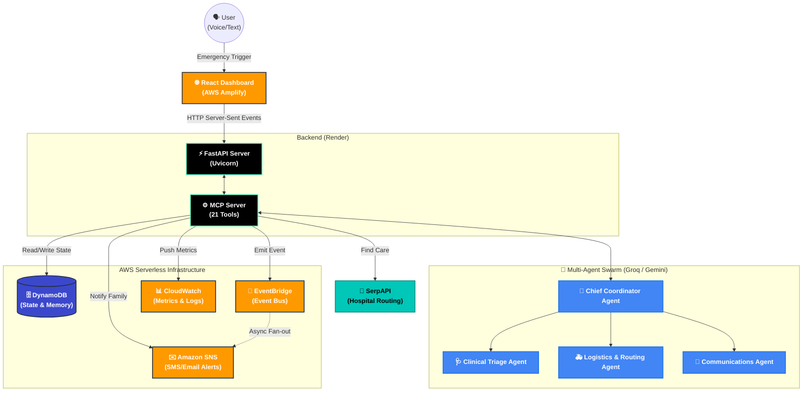

<div align="center">
  <h1>🐍 MEDUSA</h1>
  <p><b>Medical Emergency Dispatch & Universal Support Agent</b></p>
  
  <p>
    
    
    
    
  </p>
</div>

<br/>

## 🚨 The Problem: Losing the "Golden Hour"

When a medical emergency strikes in a rural or underserved area, panic sets in. Families rush the patient to the *nearest* hospital—but what if that hospital lacks a neurologist for a stroke, or a specialized trauma surgeon for an accident? 

The hospital is forced to transfer the patient yet again. This terrifying delay eats up the **"Golden Hour"**—the crucial 60-minute window following a traumatic injury where getting the *right* treatment makes the difference between life and death.

## 💡 Our Solution

**MEDUSA** is an autonomous, voice-driven AI Command Center that completely eliminates panic and guesswork from emergency response. 

The moment a crisis is reported, MEDUSA's AI agents take over:
1. **Who is it?** Instantly pulls the patient's medical history, allergies, and blood type from secure memory.
2. **What's wrong?** Analyzes the symptoms to determine clinical severity and the exact specialist required.
3. **Where to go?** Scans real-time databases to find the closest hospital that *actually has* the required specialist available.
4. **Take action:** Automatically dispatches transport, texts family members, and transmits a full clinical handoff to the receiving hospital before the patient even arrives.

---

## ⚙️ Technical Architecture



### 🧠 Agentic Architecture & MCP Server

At the core of MEDUSA is a **Multi-Agent System** powered by a custom **Model Context Protocol (MCP) Server**. This architecture grants our LLM reasoning engines the ability to interface dynamically with the physical world. Instead of just answering questions, the agent can *take action*.

The backend exposes a highly optimized tool registry containing exactly **21 Specialized Tools**. These tools are compartmentalized into distinct operational domains, allowing the AI to orchestrate complex logistics seamlessly:

#### 1. Patient Context & Memory (4 Tools)
- `resolve_kinship`: Translates natural language ("my father") into database primary keys.
- `get_patient_context`: Fetches live medical records, known conditions, and blood type.
- `get_emergency_contacts`: Retrieves primary and secondary ICE (In Case of Emergency) contacts.
- `get_important_location`: Translates fuzzy locations ("home", "college") into exact lat/lng coordinates.

#### 2. Situation & Triage (4 Tools)
- `create_incident`: Initializes a new tracked emergency in the DynamoDB state machine.
- `update_clinical_state`: Tracks patient vitals (e.g., consciousness, breathing).
- `assign_triage_priority`: Automatically classifies the emergency (e.g., CRITICAL, MODERATE).
- `record_observation`: Logs continuous field observations into the incident timeline.

#### 3. Resource Discovery & Operations (4 Tools)
- `search_care_resources`: Utilizes SerpAPI to locate nearby medical facilities.
- `check_facility_status`: Validates if a hospital is open and accepting trauma patients.
- `get_hospital_capacity`: Queries mock real-time bed availability.
- `update_incident`: Modifies the global operational state of the ongoing emergency.

#### 4. Communication & Alerts (4 Tools)
- `notify_emergency_contacts`: Triggers AWS SNS to blast SMS alerts to family.
- `notify_family`: Sends detailed email reports to primary caretakers.
- `send_incident_update`: Pushes a live status update to the command center UI.
- `broadcast_community`: Alerts nearby first-responders (simulated).

#### 5. Transport & Clinical Handoff (5 Tools)
- `request_transport`: Dispatches the nearest available ambulance.
- `coordinate_transport`: Maps the optimal route to the chosen hospital.
- `get_transport_status`: Tracks ambulance ETA.
- `get_incident_status`: Polling mechanism for the frontend to verify operational state.
- `generate_handoff`: Compiles the final **Clinical Handoff Document** containing the patient profile, incident timeline, and triage priority, transmitting it to the hospital before arrival.

---

### ⚡ Real-Time SSE Streaming

By utilizing **HTTP Server-Sent Events (SSE)**, the React frontend maintains a persistent, unidirectional connection with the FastAPI backend. As the AI agent reasons through the emergency and invokes the MCP tools above, the backend streams the narrative of the agent's "thought process" in real-time. 

This provides human operators with split-second visibility into the AI's execution pipeline, ensuring transparency and trust as it makes life-saving decisions.

## ☁️ AWS Infrastructure Deep-Dive

MEDUSA leans heavily into AWS serverless primitives to guarantee 99.99% uptime, sub-millisecond data retrieval, and highly decoupled asynchronous processing during a crisis.

### 1. Amazon DynamoDB (State & Memory Management)
In an emergency, every millisecond counts. We use **DynamoDB** as our primary persistence layer to achieve single-digit millisecond read/write latency.
- **`MedusaUserData`**: Stores patient profiles, known medical conditions, allergies, and predefined emergency contacts.
- **`MedusaIncidents`**: Acts as a high-speed state machine tracking the real-time operational status (vitals, location, assigned responders) of active emergencies.
- **`MedusaConversations`**: Persists the raw conversational transcripts between the user and the AI agent for historical context.

### 2. Amazon EventBridge (Asynchronous Escalation)
MEDUSA utilizes an Event-Driven Architecture (EDA) to decouple the AI reasoning loop from downstream operational tasks.
- When an emergency is classified as `CRITICAL`, the backend emits an `Emergency.Escalated` event to **EventBridge**.
- This unblocks the main thread, allowing EventBridge to asynchronously orchestrate secondary logistics (like routing community responders) without slowing down the primary patient interaction.

### 3. Amazon SNS (Simple Notification Service)
When the AI agent invokes the `notify_emergency_contacts` tool, the system requires immediate, guaranteed delivery.
- The backend publishes a payload to an **AWS SNS Topic**.
- SNS handles the fan-out architecture to instantly blast SMS messages and emails to the patient's entire emergency contact network, ensuring family members are alerted the second a crisis occurs.

### 4. Amazon CloudWatch (Observability & Agent Tracking)
Unchecked AI in a medical context is dangerous. We use **CloudWatch** to achieve total observability over the Multi-Agent System.
- **Custom Metrics**: We push live telemetry (e.g., `EmergencyIncidentsCreated`, `SNSPublishSuccess`) to CloudWatch to track regional emergency spikes and system health.
- **Agent Logging**: Every single tool invocation, thought process, and clinical decision made by the AI is streamed into a CloudWatch Log Group for post-incident medical audits and strict compliance tracking.

### 5. AWS Amplify (Global Edge Hosting)
The MEDUSA React Command Center is deployed globally via **AWS Amplify**.
- Amplify provides aggressive edge-caching and instant load times, ensuring the dashboard loads instantly whether the operator is in a remote rural clinic or a metropolitan hospital.
- It handles a secure, HTTPS-enforced pipeline with automatic CI/CD deployments straight from our GitHub repository.

---

## 📂 Project Structure

MEDUSA is organized into a clean monorepo, separating the Python AI backend from the React frontend.

```text
MEDUSA/
├── backend/                               # Python AI & MCP Server
│   ├── medusa/
│   │   ├── tools/                         # The 21 MCP Tools (Categorized by domain)
│   │   │   ├── care.py                    # SerpAPI hospital & specialist discovery
│   │   │   ├── communication.py           # AWS SNS & Email family notification tools
│   │   │   ├── community.py               # First-responder broadcast routing
│   │   │   ├── handoff.py                 # Clinical handoff document generation
│   │   │   ├── incident.py                # DynamoDB incident creation & tracking
│   │   │   ├── operations.py              # System-wide operational overrides
│   │   │   ├── patient.py                 # DynamoDB patient profile retrieval
│   │   │   ├── situation.py               # Environmental context & location parsing
│   │   │   ├── transport.py               # Ambulance dispatch & routing coordination
│   │   │   └── triage.py                  # Clinical severity assignment tools
│   │   ├── agent.py                       # Core LLM prompt and emergency reasoning loop
│   │   ├── cloudwatch.py                  # AWS telemetry and metric publishing
│   │   ├── database.py                    # In-memory transient state manager
│   │   ├── history_db.py                  # DynamoDB persistence layer logic
│   │   └── medusa_local.db                # Local SQLite fallback for disconnected edge nodes
│   ├── .env                               # Secret environment variables (AWS, Groq, SerpAPI)
│   ├── multi_agent_orchestrator.py        # Swarm logic connecting Chief, Triage, and Comms agents
│   ├── requirements.txt                   # Python dependencies (fastapi, groq, boto3, uvicorn)
│   ├── server.py                          # FastAPI entry point & SSE streaming logic
│   ├── simulate_alexa.py                  # CLI script for testing voice-triggered emergencies
│   └── start_with_tunnel.py               # Ngrok integration for local webhook testing
│
├── frontend/                              # React & TypeScript Command Center
│   ├── src/
│   │   ├── components/
│   │   │   ├── CommandCenter/
│   │   │   │   ├── AgentStatusGrid.tsx    # Renders the Multi-Agent swarm online statuses
│   │   │   │   ├── AWSInfrastructureState.tsx # Live metrics on DynamoDB & SNS latency
│   │   │   │   ├── CustomAgentNode.tsx    # Custom ReactFlow node for agent visualization
│   │   │   │   ├── IncidentDetailPanel.tsx# Expanded view of patient vitals and timeline
│   │   │   │   ├── MCPActivityFeed.tsx    # Live SSE feed of the AI's "thought process"
│   │   │   │   ├── MemoryTab.tsx          # Displays DynamoDB patient profile data
│   │   │   │   ├── ResponseWidgets.tsx    # Quick-action toggles for the human operator
│   │   │   │   ├── RuntimeTerminal.tsx    # Mock terminal output for hacker-style aesthetic
│   │   │   │   └── WorkflowsTab.tsx       # Draggable dynamic node graph
│   │   │   ├── DataStream.tsx             # Animated data streaming UI component
│   │   │   ├── TypewriterText.tsx         # Cyberpunk text animation utility
│   │   │   └── VoiceHero.tsx              # The main voice/text emergency input UI
│   │   ├── context/
│   │   │   └── IncidentContext.tsx        # Global React state for active emergencies
│   │   ├── pages/
│   │   │   └── CommandCenter.tsx          # Main Command Center dashboard layout
│   │   └── App.tsx                        # Main application React router
```

---

## 🧠 My Learning Journey

Building MEDUSA for this hackathon was an intense and incredibly rewarding sprint. Before this project, I hadn't worked deeply with several of these technologies, and the learning curve was steep but absolutely worth it.

### ⚡ Mastering DynamoDB & SNS
One of the biggest personal wins was integrating **Amazon DynamoDB** and **Amazon SNS**. 
- I learned how to move away from traditional relational databases and embrace DynamoDB's NoSQL single-digit millisecond latency, which is absolutely vital for a real-time emergency state machine. 
- Connecting **SNS (Simple Notification Service)** taught me how to implement true fan-out event-driven architectures. Learning how to trigger programmatic SMS and Email blasts to family members based on an AI agent's decision was a huge breakthrough for me.

### 🏗️ The AWS Lambda Pivot (A Real-World Engineering Lesson)
Originally, MEDUSA's FastAPI backend was entirely built to run on **AWS Lambda** (using the `Mangum` adapter) to achieve a 100% serverless, zero-maintenance deployment. 

However, we hit a real-world infrastructure roadblock: **AWS Account Verification Limits**. Due to security restrictions and quota limits on new AWS accounts during the hackathon weekend, we were unable to secure the necessary execution environments to deploy the Lambda function to production in time. 

Instead of giving up, I learned how to rapidly pivot infrastructure under pressure. I migrated the compute layer to **Render** for high-availability hosting, while keeping the entire database, event bus, and notification layer firmly rooted in AWS. This taught me a massive lesson in decoupled architecture—because the system was built modularly, migrating the compute layer didn't break the database or the React frontend!

---

## 🚀 Local Setup

### 1. Clone the Repository
```bash
git clone https://github.com/Nexorax-nk/MEDUSA.git
cd MEDUSA
```

### 2. Backend Setup (FastAPI)
```bash
cd backend
python -m venv venv
# On Windows: venv\Scripts\activate
# On Mac/Linux: source venv/bin/activate
pip install -r requirements.txt
```

Create a `.env` file in the `backend/` directory:
```env
AWS_ACCESS_KEY_ID=your_aws_key
AWS_SECRET_ACCESS_KEY=your_aws_secret
AWS_DEFAULT_REGION=us-east-1

GEMINI_API_KEY=your_gemini_key
GROQ_API_KEY=your_groq_key
SERPAPI_API_KEY=your_serpapi_key
```

Run the server:
```bash
uvicorn server:app --reload
```

### 3. Frontend Setup (React)
```bash
cd frontend
npm install
npm run dev
```
Open `http://localhost:5173` in your browser.

---

## 🎉 Acknowledgements

This project was proudly built for the **[Bharat Builds Tour](https://www.wemakedevs.org/aws)** hackathon. 

We were deeply inspired by the prompt to *"build something that solves a real problem: one you deal with yourself, one the people around you face every day, or a clunky way of doing things nobody has bothered to fix yet."* 

The glaring inefficiencies in rural emergency medical dispatch is a terrifying, clunky reality that costs lives every single day. **MEDUSA** was our attempt to think outside the box in the healthcare sector and build a solution that genuinely matters. 

A massive thank you to **WeMakeDevs** and **AWS** for organizing this incredible event, providing the platform to build, and pushing us to tackle real-world problems head-on. 

<br/>

<div align="center">
  <b>Built with ❤️ by Naveen. Saving lives, one millisecond at a time.</b>
</div>
